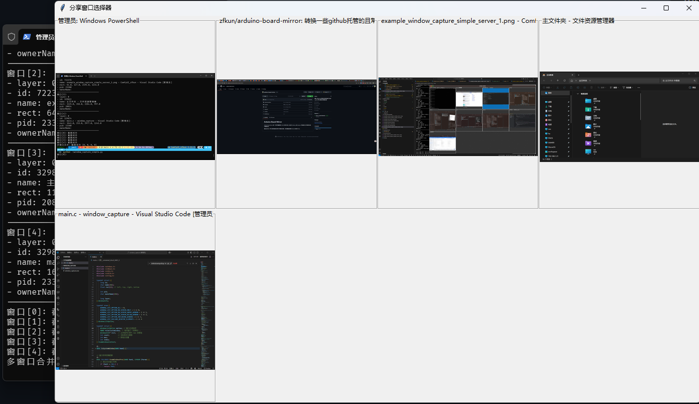
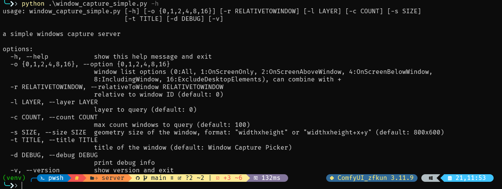
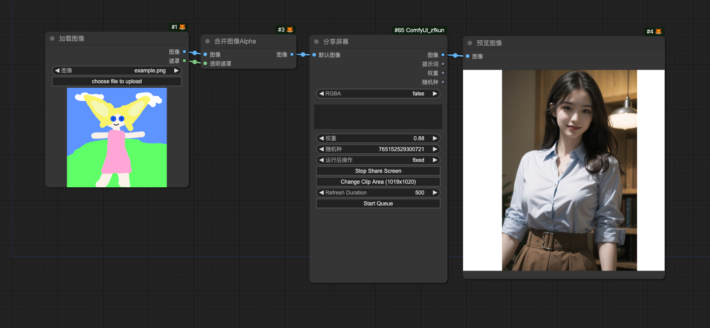
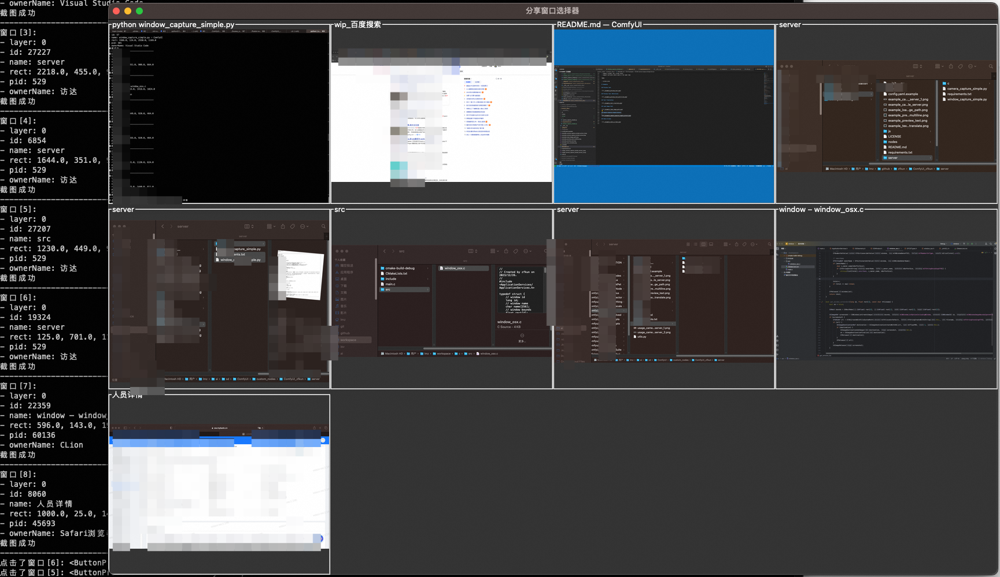

# ComfyUI zfkun

**Custom nodes pack for ComfyUI**

# ChangeLog

## 2025-07-21

- update version to `0.0.13`
- add **windows** support for `Window Capture Simple` Server

## 2025-03-24

- update version to `0.0.12`
- add [bigmodel](https://bobtranslate.com/service/translate/zhipu.html) platform for text translate node
- add [siliconflow](https://bobtranslate.com/service/translate/siliconflow.html) platform for text translate node

## 2025-03-10

- update version to `0.0.11`
- Fix the script failure problem caused by changes in the logic related to `WEB_DIRECTORY`.

- update version to `0.0.10`
- fix detection logic for requirement package. See #6
- fix preview video position for `Share Screen` node

## 2025-01-01

- update version to `0.0.9`
- fix language code of `Simplified Chinese` for `Text Translation` node
- `Comfy Registry` support

## 2024-01-21

- update version to `0.0.8`
- add error tips for `Share Screen` node
- Optimize some logic for `Share Screen` node

## 2024-01-06

- update version to `0.0.7`
- add `Clip Area` support for `Share Screen` node
- add `Refresh Duration` support for `Share Screen` node

## 2023-12-27

- add `Window Capture Simple` Server (WIP)

## 2023-12-24

- update version to `0.0.6`
- add `Share Screen` node

## 2023-12-17

- update version to `0.0.5`
- fix translation error for `alibaba` platform
- fix translator name typo for `tencent` platform

## 2023-12-17

- update version to `0.0.4`
- update README
- add `Load Image Path` node
- add `Camera Capture Simple` server

## 2023-12-16

- update version to `0.0.3`

- add [niutrans](https://bobtranslate.com/service/translate/niu.html) platform for text translate node

## 2023-12-15

- update version to `0.0.2`

- add auto converting encoding to `utf-8` for `config.yaml`

- add auto install requirements

## 2023-12-08

- add [baidu](https://bobtranslate.com/service/translate/baidu.html), [alibaba](https://bobtranslate.com/service/translate/ali.html), [tencent](https://bobtranslate.com/service/translate/tencent.html), [volcengine](https://bobtranslate.com/service/translate/volcengine.html) platform for text translate node

- update README

# Installation

## Using ComfyUI Manager (recommended)

Install [ComfyUI Manager](https://github.com/ltdrdata/ComfyUI-Manager) and do steps introduced there to install this repo.

## Alternative

```shell
cd ComfyUI/custom_nodes/
git clone https://github.com/zfkun/ComfyUI_zfkun

# comfyui use system python
pip install -r requirements.txt

# if comfyui use venv
# path/to/ComfUI/venv/bin/python -s -m pip install -r requirements.txt

# restart ComfyUI
```

## Server

### Camera Capture Simple

a simple camera capture server.

mainly used with `Load Image Path` and `LCM` for **real-time virtual live** workflow

#### feature

- custom capture source (0, 1, 2 ...)
- custom output directory
- custom output filename (`*` will be replaced by `%Y%m%d_%H%M%S`)

#### useage

> the paths to `ComfyUI` and `python` need to be modified to suit for you.

> in my case, `ComfyUI` in `./ComfyUI` and `python` in `./ComfyUI/venv` with **venv**

basic

```shell
# enter ComfyUI's home
cd ./ComfyUI

# active virtual environment for python
source ./venv/bin/activate

# enter server's home
cd ./custom_nodes/ComfyUI_zfkun/server

# start server with custom output directory
python camera_capture_simple.py -o ~/ai/sd/output_webcam
```


### Window Capture Simple Server

a simple windows capture server.

mainly used with `Load Image Path` and `LCM` for **real-time virtual live** workflow

#### feature

- support filter for query (all, onscreen, above, below, include, exclude, ...)
- support find window by relative window
- support custom window UI (size, position, title)

#### useage

> the paths to `ComfyUI` and `python` need to be modified to suit for you.

> in my case, `ComfyUI` in `./ComfyUI` and `python` in `./ComfyUI/venv` with **venv**

basic

```shell
# enter ComfyUI's home
cd ./ComfyUI

# active virtual environment for python
source ./venv/bin/activate

# enter server's home
cd ./custom_nodes/ComfyUI_zfkun/server

# start server with custom output directory
python window_capture_simple.py
```



advanced

```shell
python window_capture_simple.py -h
```



## Nodes

### Preview Text

support text、primitive (text) for input

### Preview Text (Multiline)

support text、primitive (clip text) for input

### Text Translation

support platforms:

- [baidu (百度翻译)](https://bobtranslate.com/service/translate/baidu.html)
- [alibaba (阿里翻译)](https://bobtranslate.com/service/translate/ali.html)
- [tencent (腾讯翻译)](https://bobtranslate.com/service/translate/tencent.html)
- [volcengine (火山翻译)](https://bobtranslate.com/service/translate/volcengine.html)
- [niutrans (小牛翻译)](https://bobtranslate.com/service/translate/niu.html)
- [bigmodel (智谱 GLM)](https://bobtranslate.com/service/translate/zhipu.html)
  > default model: `glm-4-flash` (**free**)
  >
  > support model: `glm-4-plus`、`glm-4-air`、`glm-4-air-0111` (**Preview**)、`glm-4-airx`、`glm-4-long`、`glm-4-flashx`、`glm-4-flash` (**free**)
- [siliconflow (硅基流动)](https://bobtranslate.com/service/translate/siliconflow.html)
  > default model: `Qwen/Qwen2.5-7B-Instruct` (**free**)
  >
  > support model: `Qwen/QwQ-32B`, `Pro/deepseek-ai/DeepSeek-R1`, `Pro/deepseek-ai/DeepSeek-V3`, `deepseek-ai/DeepSeek-R1`, `deepseek-ai/DeepSeek-V3`, `deepseek-ai/DeepSeek-R1-Distill-Qwen-32B`, `deepseek-ai/DeepSeek-R1-Distill-Qwen-14B`, `deepseek-ai/DeepSeek-R1-Distill-Qwen-7B` (**free**), `deepseek-ai/DeepSeek-R1-Distill-Qwen-1.5B` (**free**), `Pro/deepseek-ai/DeepSeek-R1-Distill-Qwen-7B`, `Pro/deepseek-ai/DeepSeek-R1-Distill-Qwen-1.5B`, `deepseek-ai/DeepSeek-V2.5`, `Qwen/Qwen2.5-72B-Instruct-128K`, `Qwen/Qwen2.5-72B-Instruct`, `Qwen/Qwen2.5-32B-Instruct`, `Qwen/Qwen2.5-14B-Instruct`, `Qwen/Qwen2.5-7B-Instruct` (**free**), `Qwen/Qwen2.5-Coder-32B-Instruct`, `Qwen/Qwen2.5-Coder-7B-Instruct` (**free**), `Qwen/Qwen2-7B-Instruct` (**free**), `Qwen/Qwen2-1.5B-Instruct` (**free**), `Qwen/QwQ-32B-Preview`, `TeleAI/TeleChat2`, `THUDM/glm-4-9b-chat` (**free**), `Vendor-A/Qwen/Qwen2.5-72B-Instruct`, `internlm/internlm2_5-7b-chat` (**free**), `internlm/internlm2_5-20b-chat`, `Pro/Qwen/Qwen2.5-7B-Instruct`, `Pro/Qwen/Qwen2-7B-Instruct`, `Pro/Qwen/Qwen2-1.5B-Instruct`, `Pro/THUDM/chatglm3-6b`, `Pro/THUDM/glm-4-9b-chat`

> 1. create `config.yaml` (copy from `config.yaml.example`, **make sure file encoding** is `utf-8`)
> 2. update `translator` field, save
> 3. restart `ComfyUI`

### Load Image Path

- support `path` (**relative**、**absolute**、**~**、**~user**))
- support `url` (**http**、**https**)
- support `RGBA` for output image
- support `default image` for input

### Share Screen

- support window、tab、screen share
- support multiple share node at the same time
- support custom clip area
- support custom refresh duration
- support default image (`RGBA` support)
- support weight and prompt

# Examples

## Preview Text


## Preview Text (Multiline)


## Text Translation


## Load Image Path


## Share Screen



## Camera Capture Simple Server


## Window Capture Simple Server (WIP)



