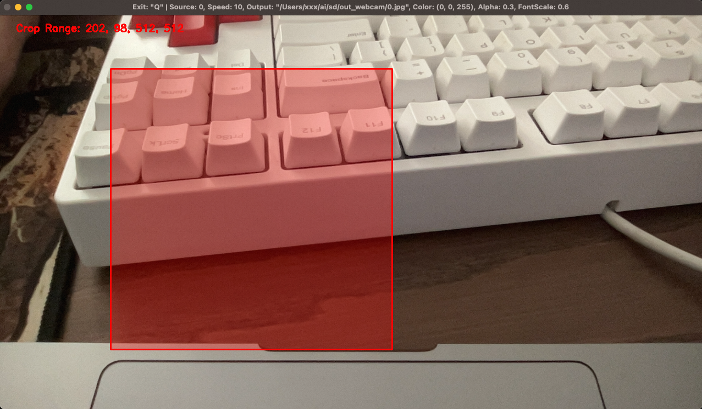
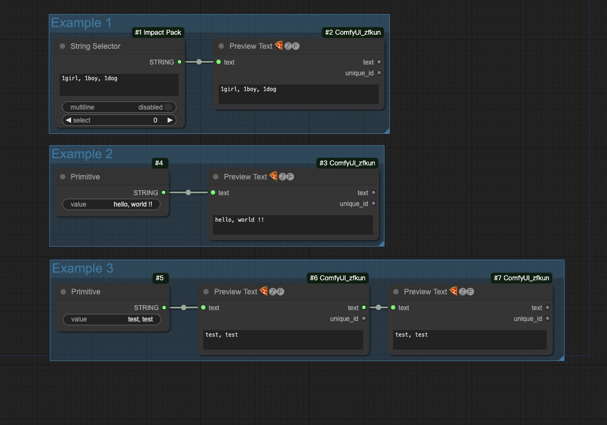
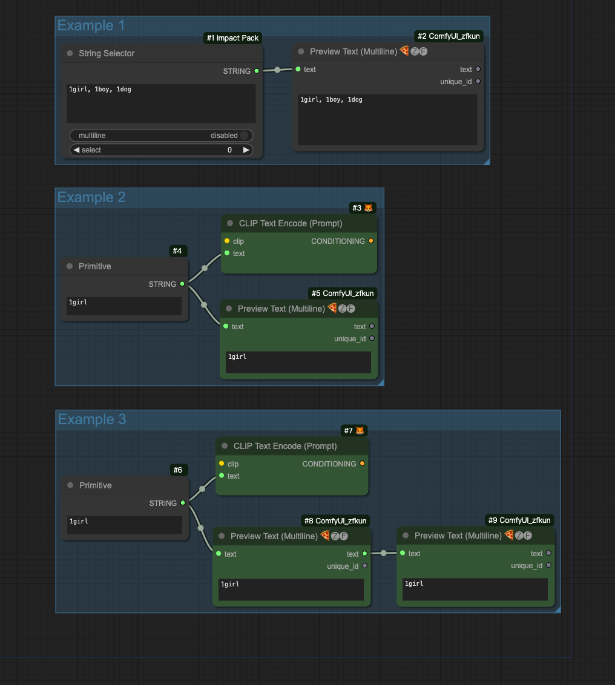
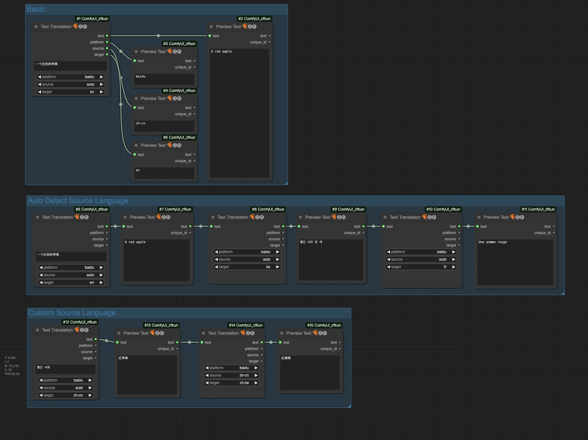
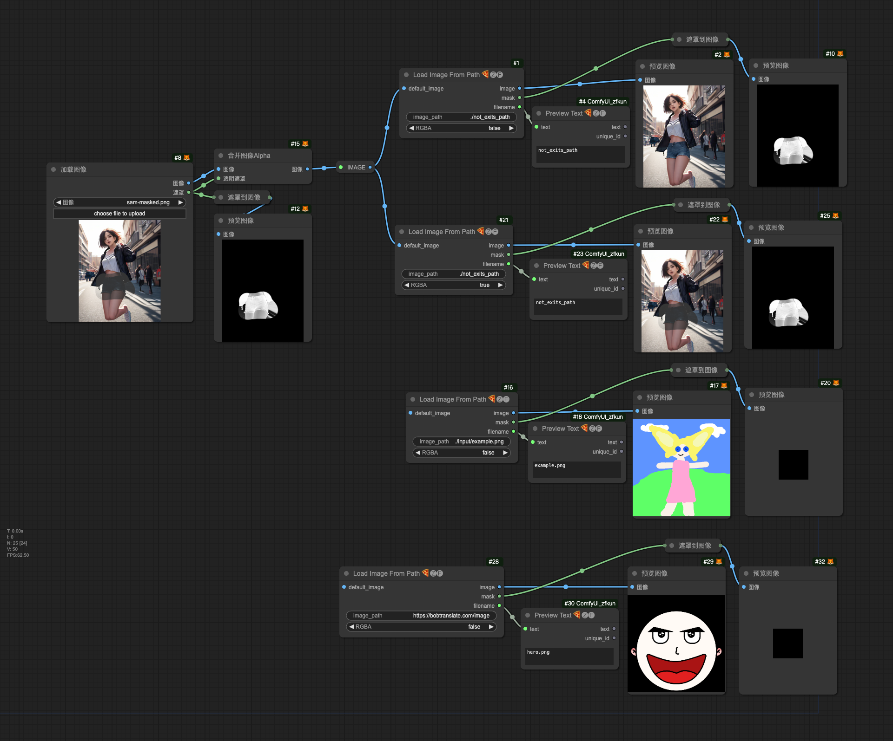
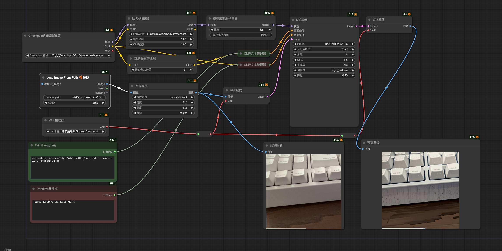

# ComfyUI zfkun

**Custom nodes pack for ComfyUI**

# ChangeLog

## 2023-12-17

- update version to `0.0.4`

- add ZFLoadImagePath node platform for text translate node

## 2023-12-16

- update version to `0.0.3`

- add [niutrans](https://bobtranslate.com/service/translate/niu.html) platform for text translate node

## 2023-12-15

- update version to `0.0.2`

- add auto converting encoding to `utf-8` for `config.yaml`

- add auto install requirements

## 2023-12-08

- add [baidu](https://bobtranslate.com/service/translate/baidu.html), [alibaba](https://bobtranslate.com/service/translate/ali.html), [tencent](https://bobtranslate.com/service/translate/tencent.html), [volcengine](https://bobtranslate.com/service/translate/volcengine.html) platform for text translate node

- update README

# Installation

## Using ComfyUI Manager (recommended)

Install [ComfyUI Manager](https://github.com/ltdrdata/ComfyUI-Manager) and do steps introduced there to install this repo.

## Alternative

```shell
cd ComfyUI/custom_nodes/
git clone https://github.com/zfkun/ComfyUI_zfkun

# comfyui use system python
pip install -r requirements.txt

# if comfyui use venv
# path/to/ComfUI/venv/bin/python -s -m pip install -r requirements.txt

# restart ComfyUI
```

## Server

### Camera Capture Simple

a simple camera capture server.

mainly used with `Load Image Path` and `LCM` for **real-time virtual live** workflow

#### feature

- custom capture source (0, 1, 2 ...)
- custom output directory
- custom output filename (`*` will be replaced by `%Y%m%d_%H%M%S`)
- custom

#### useage

> the paths to `ComfyUI` and `python` need to be modified to suit for you.

> in my case, `ComfyUI` in `./ComfyUI` and `python` in `./ComfyUI/venv` with **venv**

basic

```shell
# enter ComfyUI's home
cd ./ComfyUI

# active virtual environment for python
source ./venv/bin/activate

# enter server's home
cd ./custom_nodes/ComfyUI_zfkun/server

# start server with custom output directory
python camera_capture_simple.py -o ~/ai/sd/output_webcam
```



advanced

```shell
python camera_capture_simple.py -h
```


## Nodes

### Preview Text

support text、primitive (text) for input

### Preview Text (Multiline)

support text、primitive (clip text) for input

### Text Translation

support platforms:

- [baidu (百度翻译)](https://bobtranslate.com/service/translate/baidu.html)
- [alibaba (阿里翻译)](https://bobtranslate.com/service/translate/ali.html)
- [tencent (腾讯翻译)](https://bobtranslate.com/service/translate/tencent.html)
- [volcengine (火山翻译)](https://bobtranslate.com/service/translate/volcengine.html)
- [niutrans (小牛翻译)](https://bobtranslate.com/service/translate/niu.html)

> 1. create `config.yaml` (copy from `config.yaml.example`, **make sure file encoding** is `utf-8`)
> 2. update `translator` field, save
> 3. restart `ComfyUI`

### Load Image Path

- support `path` (**relative**、**absolute**、**~**、**~user**))
- support `url` (**http**、**https**)
- support `RGBA` for output image
- support `default image` for input

# Examples

## Preview Text



## Preview Text (Multiline)



## Text Translation



## Load Image Path



## Camera Capture Simple Server


