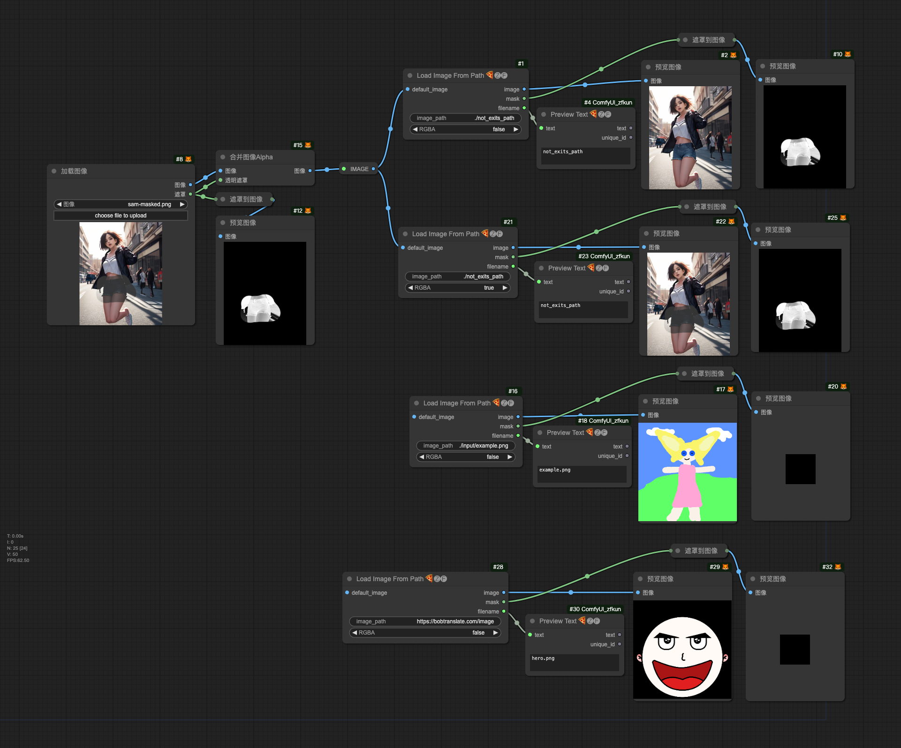

# Load Image Path 🍕🅩🅕

Read and load images from specified addresses, supporting network addresses, local full paths, and local relative paths

## Feature

- support `path` (**relative**、**absolute**、**~**、**~user**))
- support `url` (**http**、**https**)
- support `RGBA` for output image
- support `default image` for input

## Parameter

- **image_path**: Network address or local path (supports relative paths) of the image to be loaded

    > default is `./input/example.png`

- **default_image**: Fallback image used when the specified loading address is invalid or reading fails

- **RGBA**: Whether to export the image in RGBA format

## Usage

