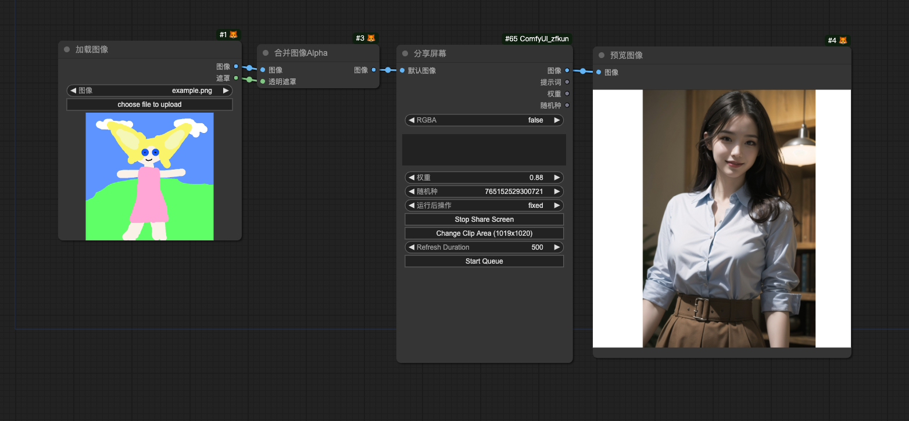

# 分享屏幕 🍕🅩🅕

读取共享屏幕的实时图像, 支持区域裁剪及提示词调整

## 特点

- 支持 窗口捕获、摄像头采集、屏幕共享等
- 支持 多个分享屏幕节点同时使用
- 支持 自定义区域裁剪
- 支持 自定义刷新间隔
- 支持 兜底默认图 (支持 `RGBA`)
- 支持 权重和提示词

## 参数

- **image_base64**: 采集图像的 base64 数据
- **default_image**: 当从共享屏幕读取失败时, 使用的兜底图像
- **RGBA**: 是否使用 RGBA 格式导出图像
- **prompt**: 对读取到的图像做进一步调整的提示词
- **weight**: 对读取到的图像做进一步调整的权重

    > 范围: [0, 1], 精度: 0.01, 默认值: 1

- **seed**: 对读取到的图像做进一步调整的随机种子

    > 范围: [0, 1000000000], 默认值: 0

- **control_after_generate**: 生成图像后是否进行控制

    > 选项: ["fixed", "increment", "decrement", "randomize"], 默认值: "randomize"

## 用法

## 服务端

我也提供了2个轻量服务端程序, 用于实时采集生成图片到本地, 给本节点 image_base64 参数提供支持

- [Camera Capture Simple](https://github.com/zfkun/ComfyUI_zfkun?tab=readme-ov-file#camera-capture-simple)

- [Window Capture Simple Server](https://github.com/zfkun/ComfyUI_zfkun?tab=readme-ov-file#camera-capture-simple)
