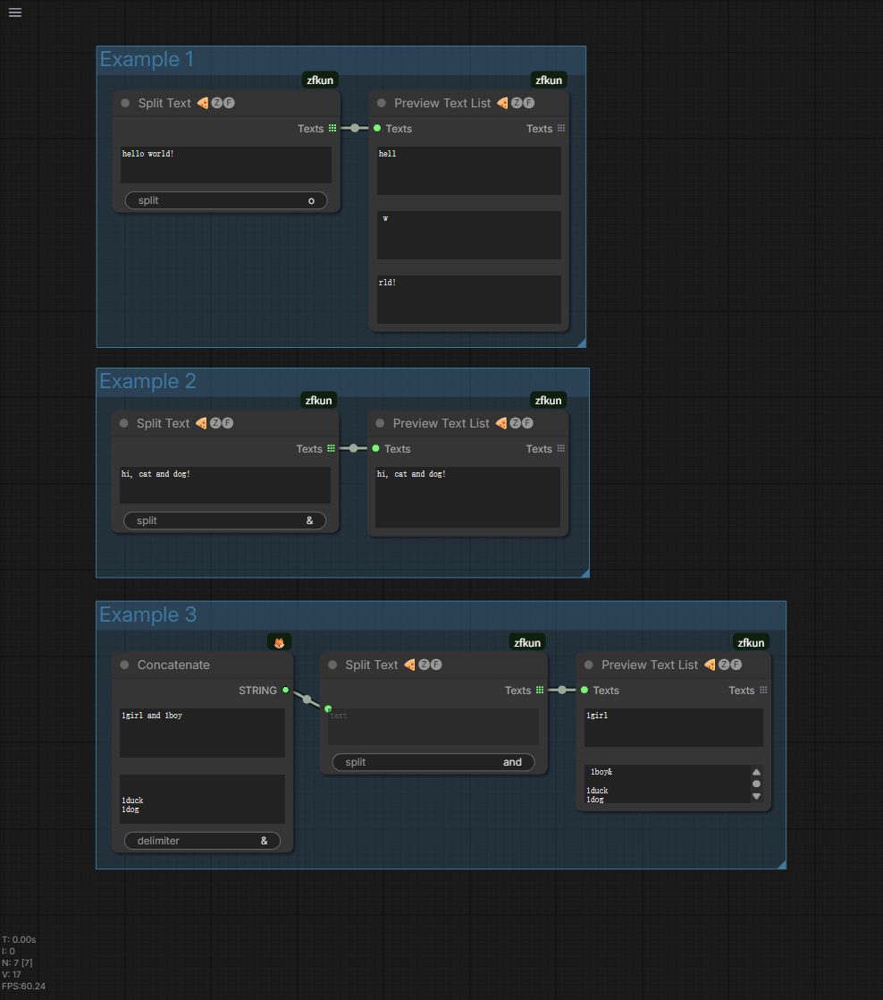

# Split Text 🍕🅩🅕

Split text to list node

## Feature

- support `text`、`primitive (string multiline)` for input

## Parameter

- **text**: Original text content to be split
- **delimiter**: Separator (default: `&`)

## Usage

