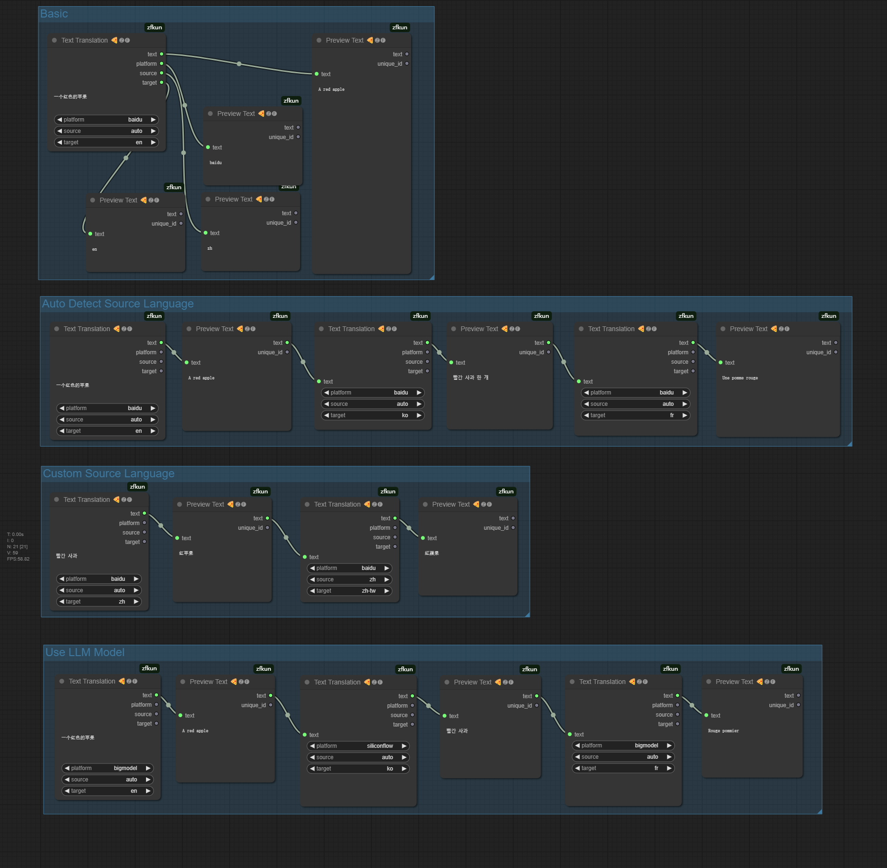

# 文本翻译 🍕🅩🅕

多语言文本翻译节点, 支持众多免费平台

## 特点

- 支持多免费平台:

    - [baidu (百度翻译)](https://bobtranslate.com/service/translate/baidu.html)
    - [alibaba (阿里翻译)](https://bobtranslate.com/service/translate/ali.html)
    - [tencent (腾讯翻译)](https://bobtranslate.com/service/translate/tencent.html)
    - [volcengine (火山翻译)](https://bobtranslate.com/service/translate/volcengine.html)
    - [niutrans (小牛翻译)](https://bobtranslate.com/service/translate/niu.html)
    - [bigmodel (智谱 GLM)](https://bobtranslate.com/service/translate/zhipu.html)
        > 默认模型: `glm-4-flash` (**free**)
        >
        > 可选模型: `glm-4-plus`、`glm-4-air`、`glm-4-air-0111` (**Preview**)、`glm-4-airx`、`glm-4-long`、`glm-4-flashx`、`glm-4-flash` (**free**)
    - [siliconflow (硅基流动)](https://bobtranslate.com/service/translate/siliconflow.html)
        > 默认模型: `Qwen/Qwen2.5-7B-Instruct` (**free**)
        >
        > 可选模型: `Qwen/QwQ-32B`, `Pro/deepseek-ai/DeepSeek-R1`, `Pro/deepseek-ai/DeepSeek-V3`, `deepseek-ai/DeepSeek-R1`, `deepseek-ai/DeepSeek-V3`, `deepseek-ai/DeepSeek-R1-Distill-Qwen-32B`, `deepseek-ai/DeepSeek-R1-Distill-Qwen-14B`, `deepseek-ai/DeepSeek-R1-Distill-Qwen-7B` (**free**), `deepseek-ai/DeepSeek-R1-Distill-Qwen-1.5B` (**free**), `Pro/deepseek-ai/DeepSeek-R1-Distill-Qwen-7B`, `Pro/deepseek-ai/DeepSeek-R1-Distill-Qwen-1.5B`, `deepseek-ai/DeepSeek-V2.5`, `Qwen/Qwen2.5-72B-Instruct-128K`, `Qwen/Qwen2.5-72B-Instruct`, `Qwen/Qwen2.5-32B-Instruct`, `Qwen/Qwen2.5-14B-Instruct`, `Qwen/Qwen2.5-7B-Instruct` (**free**), `Qwen/Qwen2.5-Coder-32B-Instruct`, `Qwen/Qwen2.5-Coder-7B-Instruct` (**free**), `Qwen/Qwen2-7B-Instruct` (**free**), `Qwen/Qwen2-1.5B-Instruct` (**free**), `Qwen/QwQ-32B-Preview`, `TeleAI/TeleChat2`, `THUDM/glm-4-9b-chat` (**free**), `Vendor-A/Qwen/Qwen2.5-72B-Instruct`, `internlm/internlm2_5-7b-chat` (**free**), `internlm/internlm2_5-20b-chat`, `Pro/Qwen/Qwen2.5-7B-Instruct`, `Pro/Qwen/Qwen2-7B-Instruct`, `Pro/Qwen/Qwen2-1.5B-Instruct`, `Pro/THUDM/chatglm3-6b`, `Pro/THUDM/glm-4-9b-chat`

## 参数

- **text**: 要翻译的原始文本内容
- **platform**: 要使用的翻译平台
    - 选项:
        - baidu         (百度翻译)
        - alibaba       (阿里翻译)
        - tencent       (腾讯翻译)
        - volcengine    (火山翻译)
        - niutrans      (小牛翻译)
        - bigmodel      (智谱 GLM)
        - siliconflow   (硅基流动)
    - default: `baidu`
- **source**: 待翻译文本的源语言
- **target**: 要翻译成的目标语言

## 配置

1. 在插件目录下, 创建 `config.yaml` 文件 (从 `config.yaml.example` 文件复制改名即可, **必须确保文件编码** 是 `utf-8`, 否则就另存一下修改下编码)
2. 更新 `translator` 字段里的对应平台的配置, 保存即可
3. 重启 `ComfyUI`

## 使用

